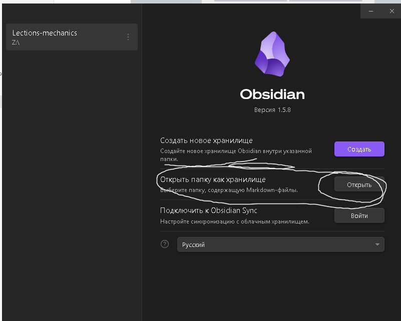
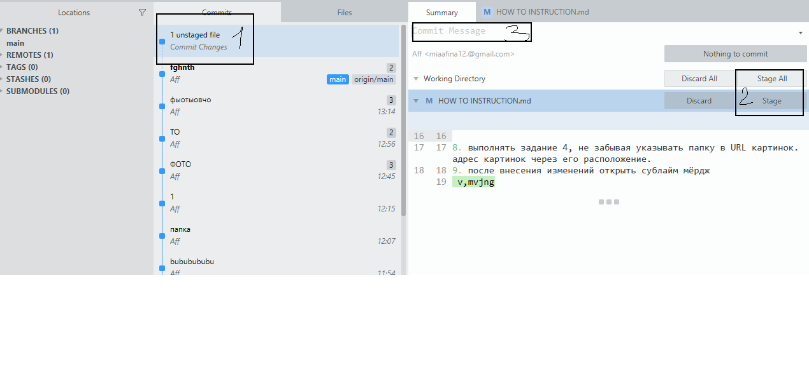

# Как пошагово все сделать???
1. Установить Обсидиан https://obsidian.md/download
2. УСТАНОВИТЬ СУБЛАЙН МЁРДЖ. https://www.sublimemerge.com/download_thanks?target=win-x64
3. ОТКРЫТЬ СУБЛАЙН МЕРДЖ И СКЛОНИРОВАТЬ РЕПОЗИТОРИЙ.
4. 
5. 
открыть клонированный репозиторий в обсидиан

6. настроить ссылки. открыть настройки обсидиана. 
7. !
8. 

8. выполнять задание 4, не забывая указывать папку в URL картинок. адрес картинок через его расположение.
9. после внесения изменений открыть сублайм мёрдж  
 v,mvjng
